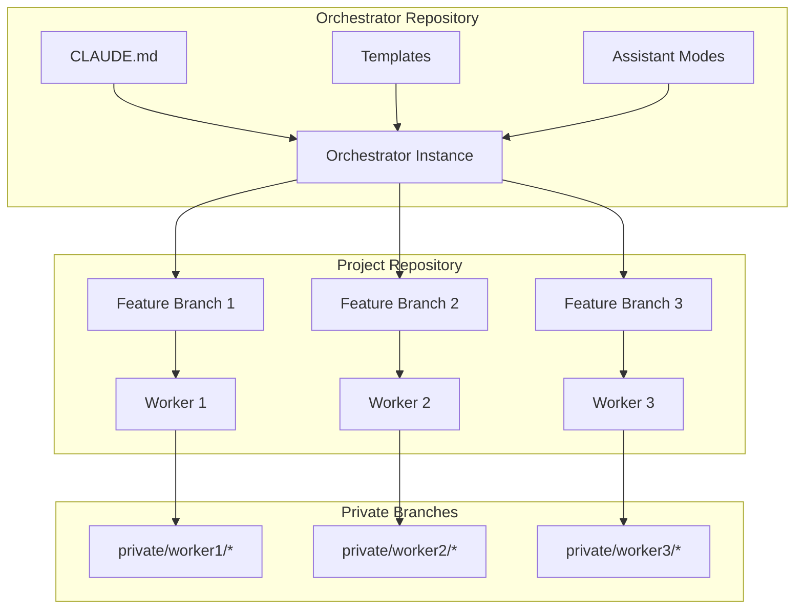
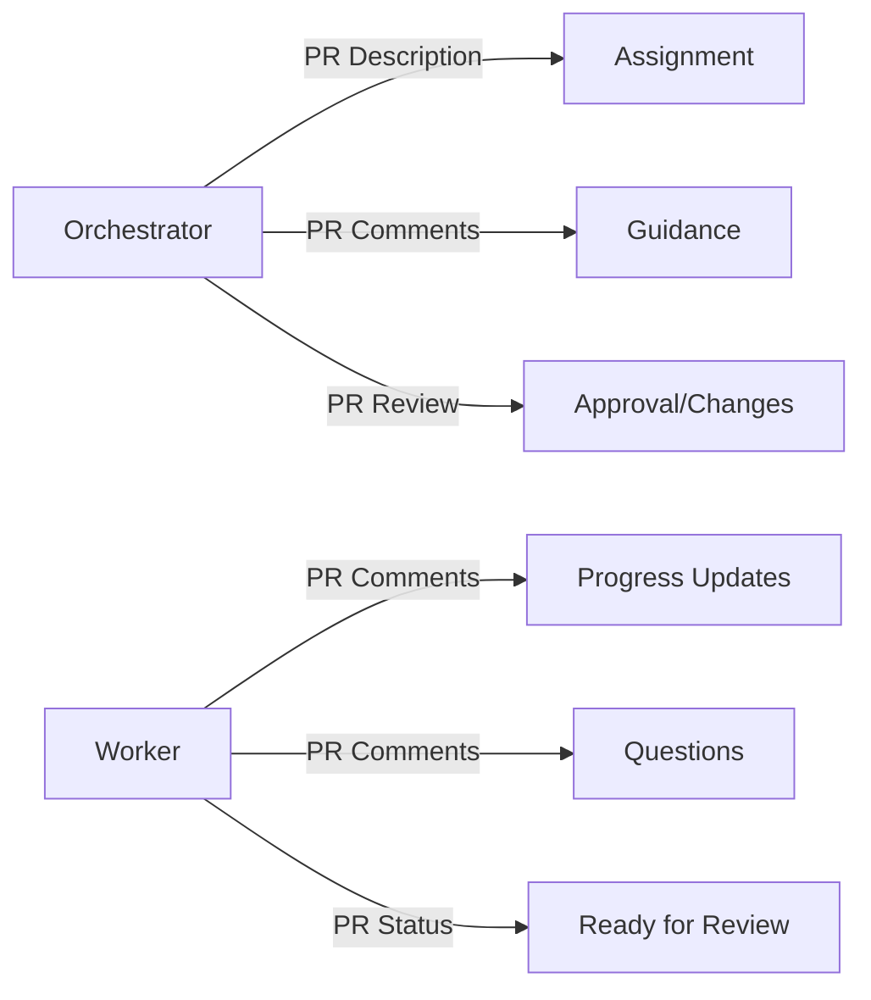

# Architecture

Technical details of how Orchestrator manages parallel AI development.

## System Design

### Core Components



### Branch Strategy

#### Feature Branches
- Isolated development environment
- Contains ONBOARDING.md and assistant/ directory
- Never contains worker's CLAUDE.md in commits
- Merges to main when complete

#### Private Branches
- Persistent knowledge storage
- Never merged to main
- Accumulates expertise over time
- Referenced for future assignments

### File Structure

```
orchestrator/
├── CLAUDE.md                    # Orchestrator configuration
├── assistant/                   # Claude Code behavioral modes
│   ├── sharp_mode.txt          # Conversational mode
│   ├── absolute_mode.txt       # Documentation mode
│   └── WORKER_SETUP_GUIDE.md   # Context isolation guide
├── templates/                   # Customizable templates
│   ├── ASSIGNMENT_TEMPLATE.md
│   ├── ONBOARDING_TEMPLATE.md
│   └── template_CLAUDE.md
└── docs/                       # GitHub Pages documentation

project/
├── feature/user-auth/          # Feature branch
│   ├── ONBOARDING.md          # Worker instructions
│   ├── assistant/             # Behavioral modes
│   └── src/                   # Project code
└── private/john/user-auth/    # Private branch
    └── CLAUDE.md              # Worker's knowledge base
```

## Key Concepts

### Context Isolation

Claude Code searches up the directory tree for CLAUDE.md files. Proper isolation ensures:

1. **Orchestrator** sees orchestrator CLAUDE.md
2. **Workers** see their project CLAUDE.md
3. No context confusion between instances

### Knowledge Persistence

Workers build expertise through:

1. **Local CLAUDE.md** - Active working context
2. **Private Branches** - Long-term knowledge storage
3. **Context Accumulation** - Growing expertise over assignments

### Communication Channels

All communication flows through GitHub:



## Implementation Details

### Assignment Creation

1. **Branch Creation**
   ```bash
   git checkout -b feature/name
   ```

2. **File Staging**
   ```bash
   cp templates/* branch/
   # Customize files
   git add .
   git commit
   ```

3. **PR Creation**
   ```bash
   gh pr create --assignee worker
   ```

### Worker Setup

1. **Context Verification**
   - Start Claude Code from project directory
   - Verify CLAUDE.md is loaded
   - Check assistant/ modes available

2. **Knowledge Management**
   - CLAUDE.md in working directory
   - Never staged for commit
   - Backed up to private branch

### Merge Process

1. **Pre-merge Checks**
   - No CLAUDE.md in commits
   - All tests passing
   - PR comments resolved

2. **Merge Strategy**
   - Squash and merge recommended
   - Preserves clean history
   - Private branches untouched

## Security Considerations

### Repository Access

- Workers need write access to project
- Private branches visible to all
- Consider access controls for sensitive projects

### Knowledge Protection

- Private branches contain learned patterns
- May include business logic insights
- Plan retention policies

## Scaling Considerations

### Multiple Workers

- Unique branch names prevent conflicts
- PR assignments ensure clarity
- Knowledge sharing through documentation

### Large Projects

- Organize workers by subsystem
- Create worker teams for complex features
- Consider hierarchical orchestration

## Future Enhancements

### Potential Automation

1. **GitHub Actions**
   - Auto-create worker branches
   - Validate no CLAUDE.md in PRs
   - Notify stale assignments

2. **Knowledge Synthesis**
   - Aggregate learnings from workers
   - Build project-wide knowledge base
   - Generate onboarding from experience

3. **Performance Metrics**
   - Track task completion time
   - Measure knowledge growth
   - Optimize assignments

[← Workflow](workflow.md) | [Best Practices →](best-practices.md)