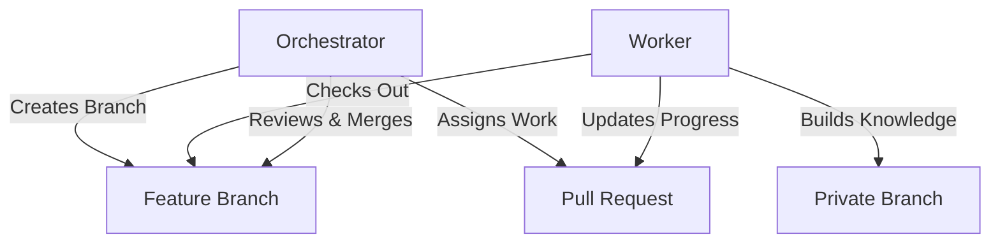

# Orchestrator

A GitHub template for orchestrating multiple Claude Code instances working in parallel on software development projects.

## What is Orchestrator?

Orchestrator provides a structured approach to managing multiple AI workers on a single codebase. It enables parallel development through branch isolation, PR-based communication, and systematic knowledge building.

## Key Features

- **Multi-Instance Coordination** - Manage multiple Claude Code instances working simultaneously
- **Branch Isolation** - Each worker operates on their own feature branch
- **PR-Based Workflow** - All communication happens through GitHub Pull Requests
- **Knowledge Persistence** - Workers build expertise over time through private branches
- **Communication Modes** - Sharp Mode for conversations, Absolute Mode for documentation

## Quick Start

1. **[Use this template](https://github.com/mboros1/orchestrator)** to create your orchestrator repository
2. Clone your new repository
3. Follow the [Setup Guide](setup.md) to configure for your project
4. Create your first [worker assignment](workflow.md)

## How It Works

## Documentation

- [Setup Guide](setup.md) - Get started with your own orchestrator
- [Workflow](workflow.md) - Understand the PR-based workflow
- [Architecture](architecture.md) - Technical details and design decisions
- [Best Practices](best-practices.md) - Tips for effective orchestration

## Use Cases

- **Large Feature Development** - Break down complex features across multiple workers
- **Parallel Bug Fixing** - Assign different bugs to different workers
- **Documentation Updates** - Coordinate documentation efforts
- **Refactoring Projects** - Systematic codebase improvements

## Why Orchestrator?

Traditional development with AI assistants faces challenges:
- Context loss between sessions
- Difficulty coordinating multiple tasks
- No systematic knowledge building
- Merge conflicts from parallel work

Orchestrator solves these through:
- Persistent context in private branches
- Clear task isolation
- Knowledge accumulation over time
- Branch-based conflict prevention

[Get Started →](setup.md)