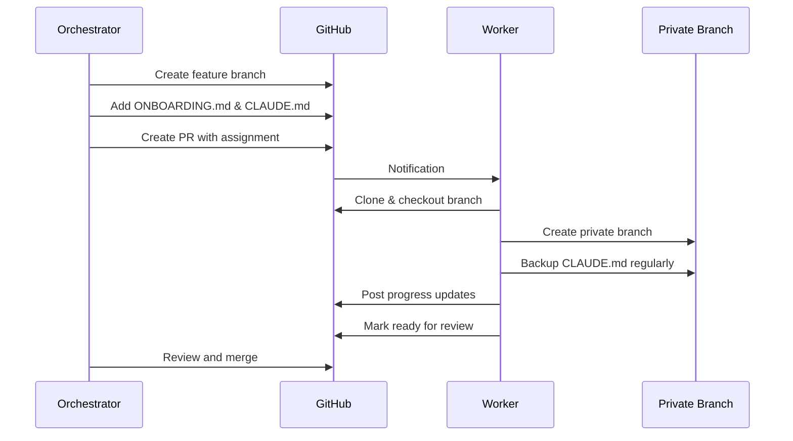

# Workflow Guide

Understanding the complete orchestration workflow from assignment to merge.

## Overview



## Orchestrator Workflow

### 1. Create Assignment

```bash
# In project repository
git checkout -b feature/user-authentication

# Copy and customize templates
cp ~/orchestrator/ONBOARDING_TEMPLATE.md ./ONBOARDING.md
cp -r ~/orchestrator/assistant ./
cp ~/orchestrator/template_CLAUDE.md ./CLAUDE.md

# Edit files with project-specific details
# Commit to branch
git add ONBOARDING.md assistant/ CLAUDE.md
git commit -m "Add worker setup files"
git push -u origin feature/user-authentication
```

### 2. Create Pull Request

```bash
gh pr create \
  --title "Worker 1: Implement User Authentication" \
  --body "$(cat ~/orchestrator/ASSIGNMENT_TEMPLATE.md)" \
  --assignee worker-username
```

### 3. Monitor Progress

- Watch for PR comments
- Respond to questions
- Provide guidance
- Review code changes

### 4. Merge Complete Work

- Ensure all tests pass
- Verify requirements met
- Approve and merge PR

## Worker Workflow

### 1. Initial Setup

```bash
# Clone and checkout
git clone https://github.com/org/project
cd project
git checkout feature/user-authentication

# Verify setup files exist
ls ONBOARDING.md assistant/ CLAUDE.md
```

### 2. Create Private Branch

```bash
# Create private branch for knowledge
git checkout -b private/john/user-auth
git add CLAUDE.md
git commit -m "Initial workspace for user auth"
git push -u origin private/john/user-auth

# Return to feature branch
git checkout feature/user-authentication

# Hide CLAUDE.md from git status
echo "CLAUDE.md" >> .git/info/exclude
```

### 3. Regular Development

1. Work on assigned tasks
2. Update CLAUDE.md with learnings
3. Commit code changes (never CLAUDE.md)
4. Post progress updates to PR

### 4. Backup Knowledge

```bash
# Quick backup workflow
git stash push -m "temp" -- CLAUDE.md
git checkout private/john/user-auth
git stash pop
git commit -am "Update: Added auth patterns"
git push
git checkout feature/user-authentication
```

### 5. Communication

#### Progress Update
```markdown
## Progress Update - Jan 15

✅ Completed:
- Set up JWT token generation
- Created login endpoint
- Added password hashing

🔧 In Progress:
- Session management
- Refresh token implementation

📝 Notes:
- Using bcrypt for password hashing
- JWT expiry set to 24 hours
```

#### When Blocked
```markdown
## 🚨 Need Help

**Issue**: Tests failing with database connection errors
**Error**: `ECONNREFUSED 127.0.0.1:5432`
**Tried**: 
- Verified postgres is running
- Checked connection string
- Reviewed test setup

Any suggestions for test database configuration?
```

#### Ready for Review
```markdown
## ✅ Ready for Review

All requirements complete:
- ✅ User registration
- ✅ Login/logout
- ✅ Password reset
- ✅ Session management
- ✅ Tests passing
- ✅ Documentation updated

Key files:
- `src/auth/` - Authentication logic
- `tests/auth/` - Test coverage
- `docs/auth.md` - API documentation

Ready to merge!
```

## Knowledge Building

### First Assignment

1. Start with provided CLAUDE.md template
2. Document project patterns you discover
3. Note helpful debugging techniques
4. Save useful code snippets

### Subsequent Assignments

1. Check your private branches:
   ```bash
   git branch -r | grep private/yourname
   ```

2. Reference previous CLAUDE.md files:
   ```bash
   git show private/yourname/previous-feature:CLAUDE.md
   ```

3. Copy relevant patterns to new CLAUDE.md
4. Build on existing knowledge

### Knowledge Evolution

```
Assignment 1: Learn project structure, basic patterns
    ↓
Assignment 2: Apply patterns, discover optimizations  
    ↓
Assignment 3: Expert-level understanding, teach others
```

## Best Practices

### For Orchestrators

- Provide clear, specific requirements
- Include relevant context in CLAUDE.md
- Respond promptly to worker questions
- Review code thoroughly before merging

### For Workers

- Update CLAUDE.md as you learn
- Backup knowledge frequently
- Communicate proactively
- Never commit CLAUDE.md to feature branch
- Reference previous work

### Communication Tips

- Use PR comments for all communication
- Include code examples when asking questions
- Update progress at least every 2 days
- Be specific about blockers

[← Setup](setup.md) | [Architecture →](architecture.md)